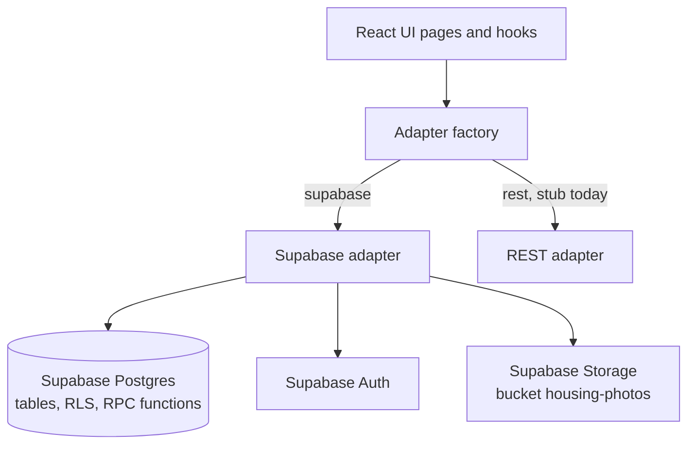
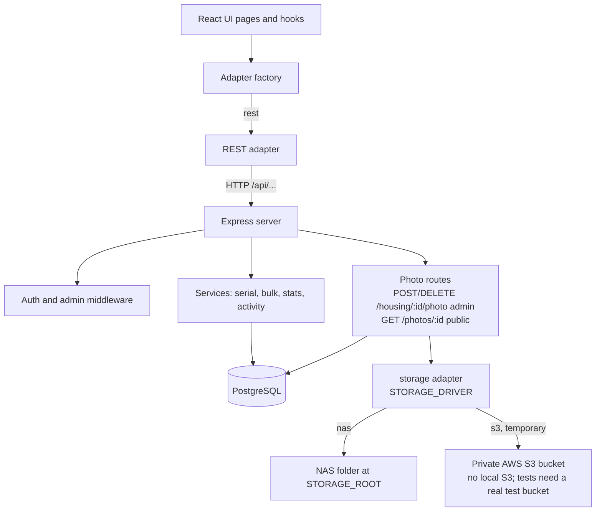
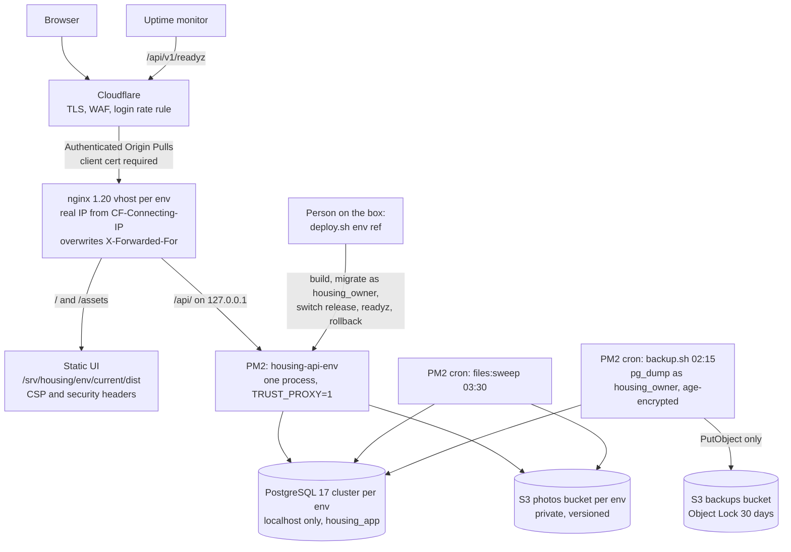
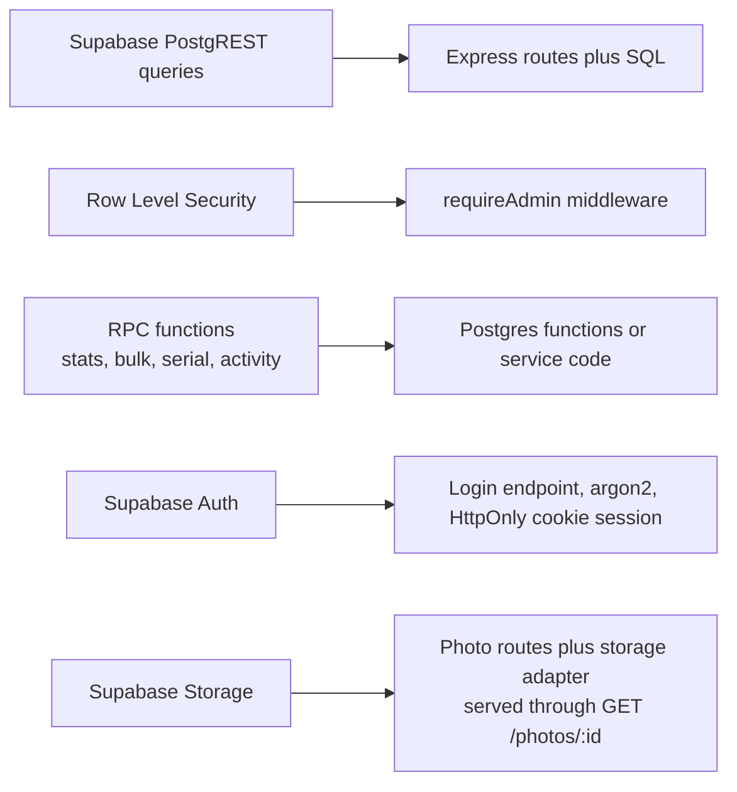

# Backend architecture: current and target

The UI only talks to three interfaces (`HousingApi`, `AuthProvider`, `ImageStorage`). A factory picks the adapter from `VITE_HOUSING_BACKEND`.

## Current: Supabase

## Target: Express and PostgreSQL

Photos (C5, `docs/plans/2026-10-05-1722-migrate-c5-photos-plan.md`): each upload is re-encoded to WebP with EXIF removed and stored under a new UUID key, with a `housing_files` row tied to the record's slot. The record's `*_url` columns hold `PUBLIC_API_URL/api/v1/photos/<file id>`, so the browser only ever loads photos through the API. Files are written before the transaction and removed after commit; a serial change touches no file.

## Deployment (C6)

Staging and production each have their own Linux user, PM2 daemon, Postgres cluster, env files in `/etc/housing/<env>/` (`api.env`, `build.env`, `deploy.env`) and photo bucket. Until cutover (C7) production runs only the API on loopback and the backups; its public vhost and UI stay on Supabase. Plan: `docs/plans/2026-10-06-0925-migrate-c6-deploy-plan.md`; steps for a person: `docs/operations/runbook.md`.

## Where each Supabase service goes

