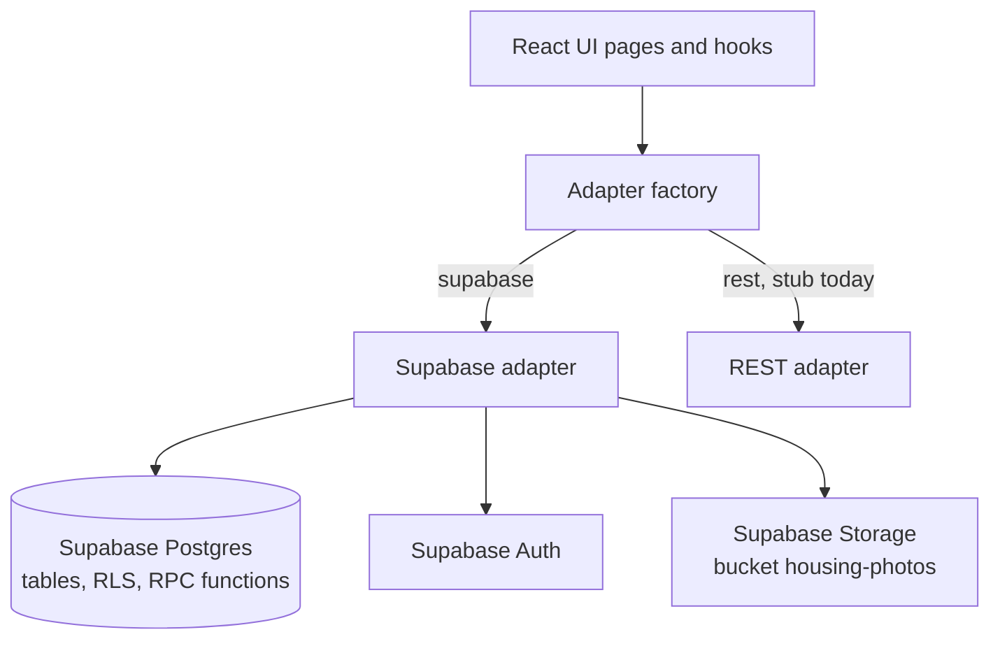
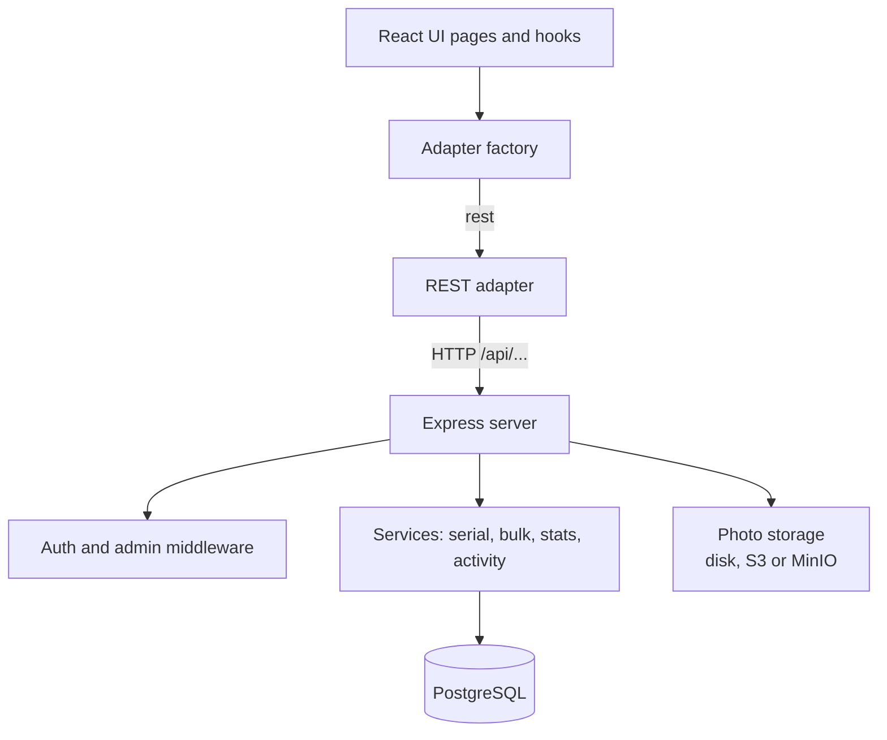
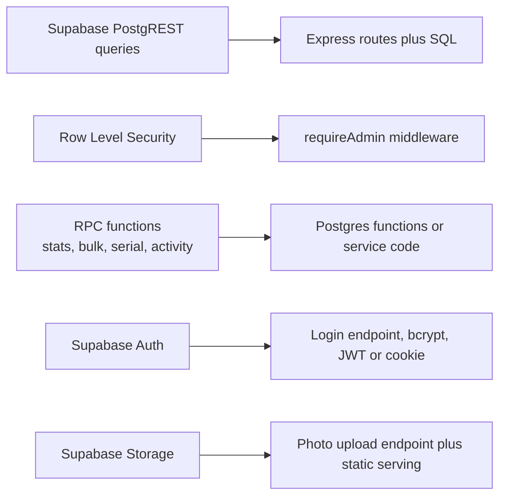

# Backend architecture: current and target

The UI only talks to three interfaces (`HousingApi`, `AuthProvider`, `ImageStorage`). A factory picks the adapter from `VITE_HOUSING_BACKEND`.

## Current: Supabase

## Target: Express and PostgreSQL

## Where each Supabase service goes

