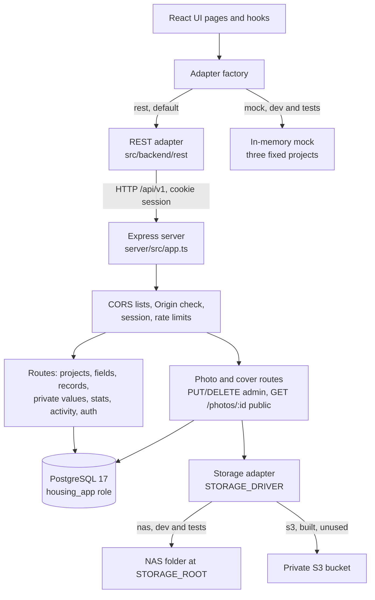
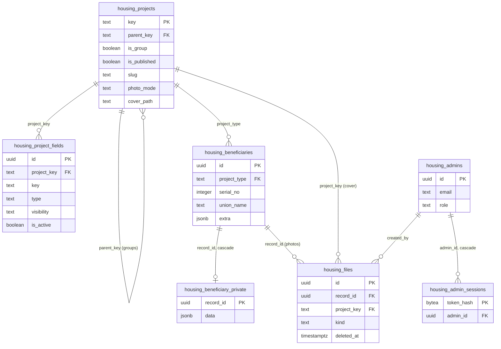

# Backend architecture

The UI talks to the backend only through the interfaces in `src/backend/interfaces/` (`HousingApi`, `ProjectsApi`, `AuthProvider`, `AdminUsersApi`). `src/backend/factory.ts` picks the adapter from `VITE_HOUSING_BACKEND`: `rest` (the default) or `mock` (dev and tests only).

## Request path

Who may do what is decided in the API: visitors see only published projects and public fields, admins also see drafts and private fields, and only the `main_admin` may delete. The data rules (field values, record checks, project and field guards, serial counters, the activity log) are triggers and functions in the database, owned by `housing_owner`.

Photos: each upload is re-encoded to WebP with its metadata removed and stored under a new UUID key, with a `housing_files` row tied to the record's slot or the project's cover. A record's photo columns and a project's `cover_path` hold `PUBLIC_API_URL/api/v1/photos/<file id>`, so the browser only ever loads photos through the API. Files are written before the transaction and removed after commit; a serial change touches no file.

## Registry tables

`housing_serial_counters`, `housing_serial_changes` and `housing_activity_log` sit beside these with no foreign key, so a deleted record's serial history and log rows stay. The migrations that build each table are listed in `docs/architecture/migration-notes.md`.
