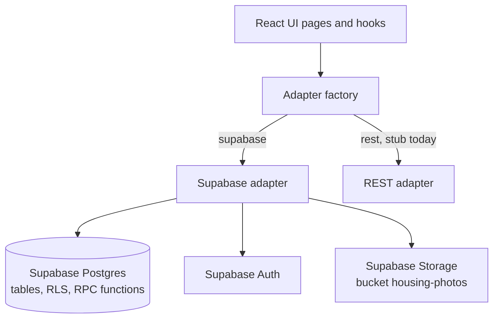
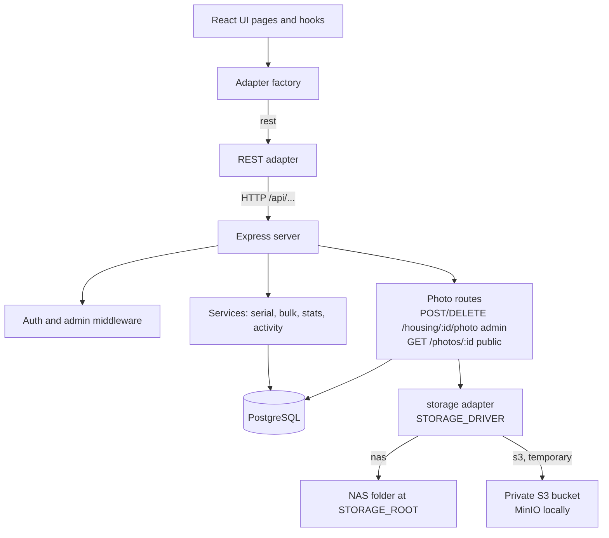
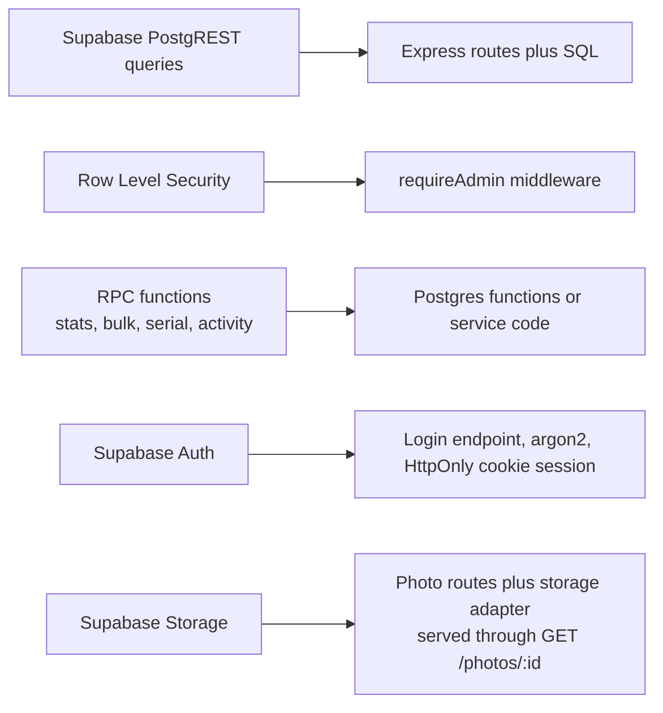

# Backend architecture: current and target

The UI only talks to three interfaces (`HousingApi`, `AuthProvider`, `ImageStorage`). A factory picks the adapter from `VITE_HOUSING_BACKEND`.

## Current: Supabase

## Target: Express and PostgreSQL

Photos (C5, `docs/plans/2026-10-05-1722-migrate-c5-photos-plan.md`): each upload is re-encoded to WebP with EXIF removed and stored under a new UUID key, with a `housing_files` row tied to the record's slot. The record's `*_url` columns hold `PUBLIC_API_URL/api/v1/photos/<file id>`, so the browser only ever loads photos through the API. Files are written before the transaction and removed after commit; a serial change touches no file.

## Where each Supabase service goes

