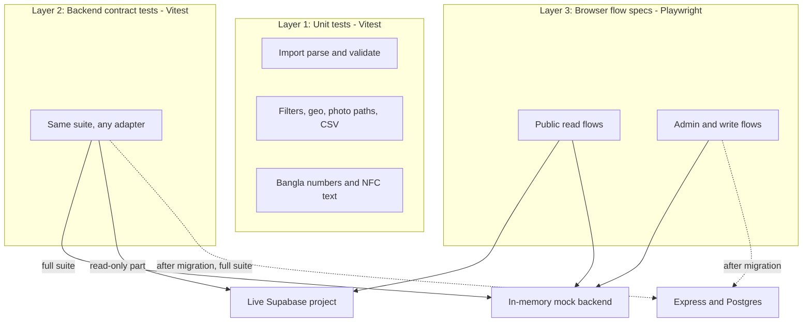
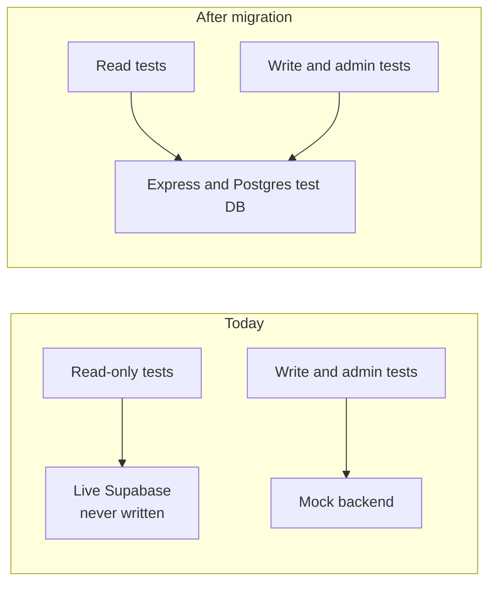
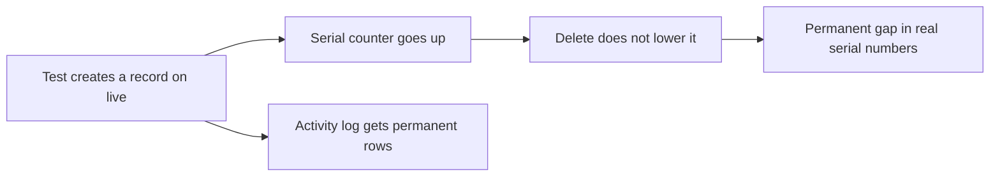

# Test strategy for the migration safety net

One contract, checked at three layers. The same specs are re-pointed at the new backend after migration.

## Which backend each test runs against

## Why live stays read-only

