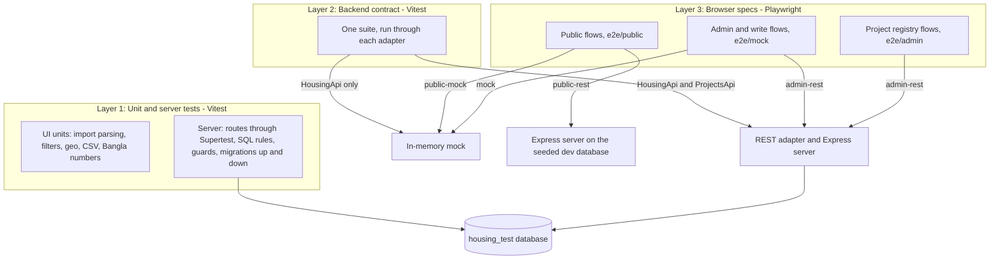
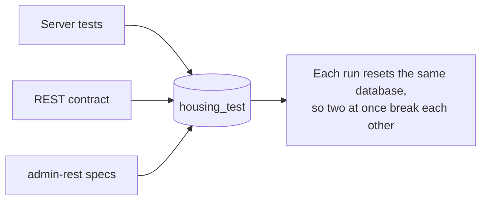

# Test strategy

One contract, checked at three layers, against two backends: the Express server on a real PostgreSQL test database, and the in-memory mock. The commands are in `docs/testing/README.md`.

## Why the mock stays small

The mock keeps three fixed projects and no project or field edits. The registry's rules (guards, stats, private fields) live in the database, and a copy in TypeScript would drift from them, so the specs that need the registry run only on `admin-rest`.

## Why the database suites run one at a time

