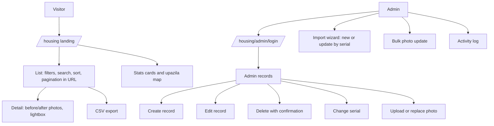

# User flows covered by browser specs

```mermaid
flowchart TB
  V[Visitor] --> L[/housing landing/]
  L --> LS[List: filters, search, sort, pagination in URL]
  LS --> D[Detail: before/after photos, lightbox]
  L --> M[Stats cards and upazila map]
  LS --> CSV[CSV export]
  A[Admin] --> LG[/housing/admin/login/]
  LG --> AD[Admin records]
  AD --> NEW[Create record]
  AD --> EDIT[Edit record]
  AD --> DEL[Delete with confirmation]
  AD --> SER[Change serial]
  AD --> PH[Upload or replace photo]
  A --> IM[Import wizard: new or update by serial]
  A --> PB[Bulk photo update]
  A --> ACT[Activity log]
```

Public flows run against the live project (read-only). Admin flows run against the mock backend until migration.
