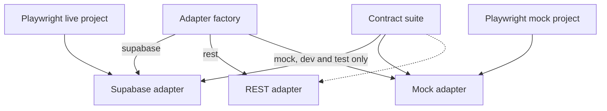

## Goal Capsule

- **Objective:** Before the backend moves from Supabase to Node.js/Express/PostgreSQL, the housing site has automated tests that prove every user-visible behavior works today, so any behavior lost in migration is caught by a failing test.
- **Means:** Unit tests, backend-contract tests that run against any backend, and one Playwright spec per user flow, with specs authored while walking the app in Chrome (KTD1, KTD2, KTD3).
- **Product authority:** The user. Scope is the test suite only. The Express/Postgres server, the `migrate-photos` rewrite and CI are not active scope.
- **Open blockers:** None for U1 to U5. U6 (live read specs) needs a `.env.local` with the Supabase URL and anon key, and U7 inherits that blocker through its dependency on U6.
- **Product Contract preservation:** changed: R9, R10. Admin login, route protection and the activity view moved from live specs to mocked specs after planning research found that login and logout write activity-log rows on the live project (user-directed). IDs unchanged.

---

## Product Contract

### Summary

Add three test layers on the `dev-forhad` branch. Unit tests cover the pure logic. Contract tests check each backend operation against `docs/api/API_CONTRACT.md`. Playwright specs cover each user flow, written during a Chrome walkthrough. The suite tests behavior the API contract promises, not Supabase specifics, so the same tests can be re-run against the new backend.

### Problem Frame

The backend is moving from Supabase to a custom Express and PostgreSQL stack. Supabase currently supplies row-level security, SQL functions for stats, bulk update and serial numbering, auth, and photo storage. The repo has no tests, so nothing would reveal that a rule such as "only admins can write" or "serials are never reused" had been dropped. The live Supabase project holds real beneficiary data and permanent serial counters, so test runs must not write to it.

### Key Decisions

- **Live project is read-only for tests.** Public browse flows run against the existing Supabase project; nothing is created, edited or deleted there. (session-settled: user-directed — chosen over live writes on a reserved serial range and over accepting burned serials: serial counters never decrease, so any live create permanently skips a real serial number.) Governs R9, R10, R12.
- **Admin flows are mocked too.** Admin login, route protection and the activity view run against the mocked backend, because login and logout write activity-log rows on live. (session-settled: user-directed — chosen over a dedicated live test admin and over skipping live admin specs.) Governs R9, R10.
- **Write flows run against a mocked backend until migration**, and for real against the new Postgres test database afterwards. (session-settled: user-directed — chosen over a separate Supabase test project.) Governs R10, R11.
- **Tests are backend-agnostic.** They assert contract behavior, not Supabase calls, so the same suite validates both backends. Governs R5, R11.
- **Branch `dev-forhad`** with `origin` at `https://github.com/rajuofficialasf-hub/house-construction.git`. The branch exists locally and is not pushed. (session-settled: user-directed.)

### Requirements

**Unit tests**
- R1. Cover the pure logic in `src/features/housing/utils/`: import parsing, import validation and column mapping, filters, geo and geo-match, photo path and photo spec, CSV export, district colors.
- R2. Cover Bangla number formatting in `src/lib/banglaNumber.ts` and the English dictionary completeness that `npm run i18n-check` enforces.
- R3. Cover text normalization: Bangla text is NFC-normalized and the equivalent forms of ড়, ঢ় and য় compare equal.
- R4. Cover the import rules from the contract: required fields, geographic values from the fixed list, serial handling, and all-or-nothing bulk behavior.

**Backend-contract tests**
- R5. Exercise each `HousingApi` operation (list, get by id, get by serial, get by serials, stats, years, filter options, next serial, create, update, delete, change serial, bulk insert, bulk update by serial, photo upload and delete, activity log) through the adapter interface, asserting the behavior in `docs/api/API_CONTRACT.md`.
- R6. Assert the invariants Supabase enforces in the database today: serial numbers are assigned per project type starting at 1, are immutable except through change-serial, and are never reused after delete.
- R7. Assert the access rule: anyone can read, only admins can write, and a non-admin account is refused at login with a forbidden result.
- R8. Assert the contract error shapes: validation, not-found, conflict, unauthenticated and forbidden map to the documented codes, and list pagination caps at the documented page size.

**Browser flow specs**
- R9. Walk the app in Chrome and write one Playwright spec per public read flow, run against the live project: landing and featured projects, list with filters, search, sort and URL-held pagination, record detail with before/after photo compare and lightbox, stats cards and upazila map, language toggle, CSV export.
- R10. Write one Playwright spec per admin and write flow against the mocked backend: admin login and logout, route protection for admin pages, create record, edit record, delete with confirmation, change serial, single photo upload and replace, bulk import wizard (new and update-by-serial modes with validation and failed-row CSV), bulk photo update, and the activity view. Each spec can be re-pointed at a real backend after migration.
- R11. Specs assert structure and relationships, not fixed record contents: filters narrow results, the detail page matches its list row, stat totals equal the list total. They never hard-code names or counts from the live records.

**Delivery**
- R12. All tests run from npm scripts on the `dev-forhad` branch, with live-project specs separable from mocked ones. Live specs read credentials from `.env.local` and never write.

### Actors

- A1. Public visitor, read-only.
- A2. Admin, an account listed in the admin table.

### Key Flows

- F1. Browse flow
  - **Trigger:** Visitor opens `/housing`.
  - **Actors:** A1
  - **Steps:** Landing, then list with filters and pagination, then record detail with photos, then stats and map.
  - **Covered by:** R9, R11
- F2. Admin write flow
  - **Trigger:** Admin logs in and opens `/housing/admin/...`.
  - **Actors:** A2
  - **Steps:** Login, create or edit or delete a record, import a sheet, update photos, review the activity log.
  - **Covered by:** R7, R10

Diagram: [../diagrams/user-flows.md](../diagrams/user-flows.md).

### Acceptance Examples

- AE1. **Covers R6.** Given a project type whose last serial is 10, when a record is created and then deleted, the next record created is serial 12, not 11.
- AE2. **Covers R7.** Given an account that exists but is not in the admin list, when it logs in, the result is forbidden and no session is created.
- AE3. **Covers R11.** Given any data in the live project, when a district filter is applied, every row shown has that district and the filtered count is no greater than the unfiltered count.
- AE4. **Covers R4, R10.** Given an import file with one invalid row, when the import runs, nothing is written and the failed row is reported.

### Success Criteria

- Running the full suite against the Express and Postgres backend with no test edits other than the backend endpoint produces the same pass results as today, or a failing test points to the exact lost behavior.
- Every route in the app has at least one flow spec.

### Scope Boundaries

**Deferred for later**
- Building the Express server and the PostgreSQL schema port.
- Rewriting `scripts/migrate-photos.mjs` for the new backend.
- CI pipeline setup.

**Not part of this work**
- Visual regression and load or performance tests.
- Pushing `dev-forhad` to the remote; this happens only when the user asks.

### Dependencies / Assumptions

- Chrome browser tooling is available for the walkthrough. If it is unavailable, specs are written from the route and component code and marked unverified.
- No `.env.local` exists on this machine today (verified by listing the repo root). Only live specs (U6) depend on it.
- The REST `HousingApi` adapter is a stub today (`src/features/housing/backend/rest/index.ts` throws NOT_IMPLEMENTED for every method). The contract suite therefore cannot target an Express backend until that adapter is written, which belongs to the migration, not this plan.

### Outstanding Questions

**Deferred to Planning**
- Whether the unit tests need a DOM environment for the import parser (it takes a `File`); decided when U2 touches it.
- Exact selectors for Bangla-language UI text; U5 and U6 decide per page, preferring roles and labels over copy.

### Sources / Research

- `docs/api/API_CONTRACT.md`, the behavioral contract the new backend must meet.
- `supabase/sql/02_serial.sql`, serial counter rules (counters never decrease).
- `supabase/sql/03_rls.sql`, the read-all and admin-write rule.
- `src/features/housing/backend/interfaces/housingApi.ts`, the adapter seam the contract tests target.
- `src/features/housing/backend/factory.ts`, where the backend is chosen from `VITE_HOUSING_BACKEND`.
- `docs/progress/HOUSING_PROGRESS.md` step 22, which records the real data on the live project.

---

## Planning Contract

### Key Technical Decisions

- KTD1. **Vitest for unit and contract tests, Playwright for browser flows.** The project is Vite-based, so Vitest reuses `vite.config.ts` and the `@` alias with no extra transform setup. Playwright is the browser runner the brainstorm named. Governs R1 to R12.
- KTD2. **A third backend kind, `mock`, implements the three adapter interfaces in memory.** It is selected by `VITE_HOUSING_BACKEND=mock`, honored only in dev and test, and loaded by dynamic import so production bundles exclude it. (session-settled: user-approved — chosen over intercepting Supabase network calls in Playwright: the mock outlives the migration and does not encode PostgREST wire format.) Serves R10.
- KTD3. **The contract suite is one function that takes an adapter factory and a capability flag.** It runs in full against the mock, in a read-only subset against the live Supabase adapter, and in full against the REST adapter once it exists. Serves R5 to R8, R12.
- KTD4. **Playwright runs two projects on two dev servers.** `live` serves `VITE_HOUSING_BACKEND=supabase` and is skipped when credentials are absent. `mock` serves `VITE_HOUSING_BACKEND=mock`. Serves R9, R10, R12.
- KTD5. **Fixtures are synthetic.** The mock seeds invented beneficiaries using valid division, district and upazila values from `src/features/housing/data/bdGeo.ts`. Live records are never copied. Serves R11.
- KTD6. **Specs are written from a Chrome walkthrough.** For each flow, drive the real page with the Chrome tools, note stable selectors and observed states, then write the Playwright spec from those notes. Serves R9, R10.
- KTD7. **The mock encodes the serial and admin rules as read from SQL.** Nothing on live proves they match. Contract tests lock the intended behavior; real verification of those rules happens only once Express exists. Serves R6, R7.

### High-Level Technical Design



More diagrams: [../diagrams/backend-architecture.md](../diagrams/backend-architecture.md), [../diagrams/test-strategy.md](../diagrams/test-strategy.md).

### Output Structure

```text
vitest.config.ts
playwright.config.ts
src/
  lib/banglaNumber.test.ts
  features/housing/
    utils/*.test.ts
    backend/mock/            # in-memory adapters and fixtures
tests/
  contract/                  # shared contract suite and its runners
e2e/
  support/                   # shared helpers
  live/                      # public read flows
  mock/                      # admin and write flows
```

### Unit Index

| Unit | Title | Key files | Depends on |
|---|---|---|---|
| U1 | Test tooling and scripts | `package.json`, `vitest.config.ts`, `playwright.config.ts` | none |
| U2 | Unit tests for pure logic | `src/features/housing/utils/*.test.ts` | U1 |
| U3 | In-memory mock backend | `src/features/housing/backend/mock/`, `factory.ts` | U1 |
| U4 | Backend-contract suite | `tests/contract/` | U1, U3 |
| U5 | Mock-mode walkthrough and specs | `e2e/mock/` | U1, U3 |
| U6 | Live read-only walkthrough and specs | `e2e/live/` | U1, `.env.local` |
| U7 | Documentation and re-pointing guide | `docs/testing/README.md` | U2 to U6 |

---

## Implementation Units

### U1. Test tooling and scripts

- **Goal:** Install and configure the runners so every later unit has a place to put tests.
- **Requirements:** R12, KTD1, KTD4.
- **Dependencies:** none.
- **Files:** `package.json`, `vitest.config.ts`, `playwright.config.ts`, `.gitignore`, `.env.example`, `scripts/i18n-check.mjs`.
- **Approach:**
  1. Add Vitest and Playwright as dev dependencies and install the Chromium browser for Playwright.
  2. Configure Vitest to reuse the Vite config, collect `*.test.ts` under `src/` and `tests/`, and load `VITE_`-prefixed variables from `.env.local` for the live read-only contract runner.
  3. Configure two Playwright projects and two web servers per KTD4; the `live` project is skipped when `VITE_SUPABASE_URL` or `VITE_SUPABASE_ANON_KEY` is missing.
  4. Add npm scripts for unit and contract tests, mocked browser specs, live browser specs, and one script that runs all but live.
  5. Ignore Playwright reports and traces in `.gitignore`.
  6. Exclude `*.test.ts` and `*.test.tsx` files from the i18n check's file walk, because test fixtures contain Bangla literals that the check would otherwise treat as untranslated UI strings and fail the i18n gate.
- **Patterns to follow:** Existing script style in `package.json`; env documentation style in `.env.example`.
- **Test scenarios:** Test expectation: none -- tooling and configuration; proven by U2 and U5 running under it.
- **Verification:** One trivial test passes under Vitest and one trivial spec passes in each Playwright project; the live project reports a clear skip with no credentials; `npm run i18n-check` still passes with a Bangla-literal test file present.

### U2. Unit tests for pure logic

- **Goal:** Pin down the behavior of every pure helper so a refactor or port cannot silently change it.
- **Requirements:** R1, R2, R3, R4.
- **Dependencies:** U1.
- **Files:** `src/features/housing/utils/csvExport.test.ts`, `districtColors.test.ts`, `filters.test.ts`, `geo.test.ts`, `geoMatch.test.ts`, `imagePath.test.ts`, `importColumns.test.ts`, `importParse.test.ts`, `importValidate.test.ts`, `mapData.test.ts`, `photoFilename.test.ts`, `photoSpec.test.ts`, `projectType.test.ts`, `uploadItems.test.ts`, `src/lib/banglaNumber.test.ts`.
- **Approach:**
  1. Write characterization tests first: record what each helper does today before judging it.
  2. Skip `imageProcessing.ts`; it needs a real canvas and is covered by the browser photo-upload specs in U5.
  3. Decide per file whether a DOM environment is needed (importParse takes a `File`).
- **Execution note:** Characterization-first. These helpers have no tests, so capture current behavior, then flag anything that looks wrong as a note rather than changing it.
- **Patterns to follow:** The contract rules in `docs/api/API_CONTRACT.md` sections 3.3 and 4.9 for validation and import.
- **Test scenarios:**
  - Happy path: Bangla digits convert to ASCII and back in `banglaNumber`; a valid import row passes validation with no errors.
  - Happy path: `photoPath` returns `housing/{project_type}/{serial 4-digit}/{kind}.webp` and the `_thumb` variant.
  - Edge case: composed and decomposed forms of ড়, ঢ় and য় compare equal after normalization.
  - Edge case: import fill-down copies year, division, district and upazila from the row above but never name, address, link or serial.
  - Edge case: a geographic name with a near-miss spelling resolves to a suggestion rather than a silent match.
  - Error path: a row missing a required field, or with a non-numeric year or a duplicate serial, reports an error on that row.
  - Error path: an unrecognized column header is left unmapped and flagged.
  - Covers AE4. An import analysis with one invalid row reports one error and the valid count excludes it.
  - Integration: CSV export of rows with commas, quotes and Bangla text round-trips through the parser unchanged.
  - Integration: the English dictionary has a key for every Bangla UI string the i18n check expects (run through `npm run i18n-check`).
- **Verification:** All unit tests pass; every util file except `imageProcessing.ts` has a test file.

### U3. In-memory mock backend

- **Goal:** Provide a backend the browser and contract tests can write to freely, with the same rules the contract promises.
- **Requirements:** R6, R7, R8, R10, KTD2, KTD5, KTD7.
- **Dependencies:** U1.
- **Files:** `src/features/housing/backend/mock/index.ts`, `store.ts`, `housingApi.ts`, `authProvider.ts`, `imageStorage.ts`, `fixtures.ts`, `src/features/housing/backend/factory.ts`, `src/vite-env.d.ts`.
- **Approach:**
  1. Implement `HousingApi`, `AuthProvider` and `ImageStorage` over one in-memory store, returning `HousingApiError` with the documented codes.
  2. Store per-project-type serial counters that never decrease; delete never lowers them.
  3. Enforce admin-only writes by checking the mock session, matching `supabase/sql/03_rls.sql`.
  4. Record an activity entry for each write, login and logout, matching `supabase/sql/09_activity_log.sql`.
  4a. Persist the store and the mock session across page reloads within one browser context (a session-scoped browser snapshot keyed by a seed version), because the store lives in page memory and every navigation would otherwise wipe it.
  4b. Expose one reset hook that restores the seed data and clears the session; the Playwright helpers call it before each spec. This hook is the only backend-specific seam in the specs.
  5. Extend `BackendKind` with `mock` and have the factory dynamic-import the mock only in dev or test; any other mode falls back to the default.
  6. Seed synthetic fixtures with valid geographic values, two project types, and at least one record with photos; include one admin and one non-admin account.
- **Patterns to follow:** The error mapping in `src/features/housing/backend/supabase/errors.ts`; the page and filter semantics in `src/features/housing/backend/supabase/housingApi.ts`.
- **Test scenarios:** The mock is verified by U4's contract suite, so this unit carries only wiring checks.
  - Integration: the factory returns the mock when the setting is `mock` in test mode.
  - Error path: in a production build mode, setting `mock` falls back to the default adapter and the mock module is absent from the bundle.
  - Integration: after a record is created and the page is reloaded, the record and the admin session are still present; the reset hook restores the seed data and logs the admin out.
- **Verification:** The app boots in dev with `VITE_HOUSING_BACKEND=mock` and shows seeded records; a production build contains no mock code.

### U4. Backend-contract suite

- **Goal:** One suite that states what any backend must do, runnable against any adapter.
- **Requirements:** R5, R6, R7, R8, KTD3, KTD7.
- **Dependencies:** U1, U3.
- **Files:** `tests/contract/housingApiContract.ts`, `tests/contract/authContract.ts`, `tests/contract/mock.contract.test.ts`, `tests/contract/supabase.readonly.contract.test.ts`.
- **Approach:**
  1. Write the suite as one function taking an adapter factory and a flag saying whether writes are allowed.
  2. Run it in full against the mock. Run only the read operations against the live Supabase adapter using the anon key; skip when credentials are missing.
  3. Keep assertions relational (counts, ordering, membership), never fixed live values.
- **Execution note:** Start with the serial-never-reused test as a failing test against the mock; it is the rule most likely to be lost in migration.
- **Patterns to follow:** Result shapes and error codes in `docs/api/API_CONTRACT.md` sections 1 and 4.
- **Test scenarios:**
  - Covers AE1. With the last serial at 10, create then delete one record; the next created record gets serial 12.
  - Happy path: list returns a page with `total`, `total_pages`, and respects `page` and `page_size`.
  - Happy path: list filters by project type, year, division, district and upazila, and `q` matches name, parent name and address.
  - Happy path: `stats.total` equals the unfiltered list total; the sum of `by_year` equals `total`; `distinct.upazilas` counts district-upazila pairs.
  - Happy path: `getBySerials` returns found records and silently omits missing serials.
  - Happy path: bulk update by serial returns `updated` and lists unknown serials in `missing` without error.
  - Edge case: `page_size` above the cap is clamped to 100.
  - Edge case: creating with an explicit serial raises the counter to at least that serial.
  - Edge case: `changeSerial` to a used serial returns a conflict and leaves both records unchanged; an unused target succeeds and the old serial is not reused.
  - Edge case: `bulkInsert` is all-or-nothing in the documented mode and reports failed rows by index.
  - Error path: update with an unknown id returns not found; create with an invalid project type returns a validation error.
  - Error path: patching `project_type` or `serial_no` directly is rejected.
  - Covers AE2. A non-admin account logging in gets forbidden and no session.
  - Error path: any write without a session returns unauthenticated; with a non-admin session returns forbidden.
  - Integration: every write adds an activity entry with the right action; `listActivity` is admin-only and newest first.
  - Integration: `uploadPhoto` sets the URL and `photo_updated_at`; `deletePhoto` clears them.
- **Verification:** Full suite passes against the mock; the read-only subset passes against live when credentials exist and skips cleanly when they do not.

### U5. Mock-mode walkthrough and specs

- **Goal:** One Playwright spec per admin and write flow, authored from a Chrome walkthrough of the mocked app.
- **Requirements:** R10, R11, F2, KTD4, KTD6.
- **Dependencies:** U1, U3.
- **Files:** `e2e/support/auth.ts`, `e2e/support/data.ts`, `e2e/mock/login.spec.ts`, `route-protection.spec.ts`, `record-create.spec.ts`, `record-edit.spec.ts`, `record-delete.spec.ts`, `serial-change.spec.ts`, `photo-upload.spec.ts`, `import-new.spec.ts`, `import-update.spec.ts`, `photo-bulk.spec.ts`, `activity.spec.ts`.
- **Approach:**
  1. Start the app in mock mode and walk each flow in Chrome with the browser tools, noting labels, roles and states.
  2. Write the spec for that flow from the notes, then run it.
  3. Call the mock reset hook before each spec so specs are independent; a spec that needs prior writes performs them itself.
  4. Prefer role and label selectors; add a test id to a component only where no stable selector exists.
- **Execution note:** Write each spec right after walking its flow; do not batch the walkthrough ahead of the specs.
- **Patterns to follow:** The route list in `src/features/housing/routes.tsx` and page components under `src/features/housing/pages/`.
- **Test scenarios:**
  - Happy path: admin logs in, lands on the records page, logs out, and is sent to login.
  - Error path: wrong password shows the generic credentials message; a non-admin account shows the not-an-admin message.
  - Edge case: opening an admin URL while logged out redirects to login; after login the user returns to the page they asked for.
  - Happy path: create a record with a blank serial; it appears in the list with the next serial.
  - Happy path: edit a record's address; the detail view shows the change.
  - Happy path: delete asks for confirmation; cancel keeps the record, confirm removes it and the serial stays used.
  - Edge case: change a serial to one already in use shows the conflict warning and changes nothing.
  - Happy path: upload a photo pair for a record; list thumbnail and detail compare view show it; replace and delete it.
  - Happy path: import wizard, new mode: map columns, preview with a geographic correction, run, see the summary.
  - Covers AE4. Import with one invalid row writes nothing and offers the failed-row CSV.
  - Happy path: import, update-by-serial mode reports updated and missing counts.
  - Happy path: bulk photo update matches files to serials and reports done, failed and skipped.
  - Integration: in the same spec, after creating, editing, deleting a record and changing a serial, the activity view lists those events newest first.
- **Verification:** `npm run test:e2e:mock` passes from a clean state; each admin route has at least one spec.

### U6. Live read-only walkthrough and specs

- **Goal:** One Playwright spec per public read flow, run against the live project without writing.
- **Requirements:** R9, R11, R12, F1, KTD4, KTD6.
- **Dependencies:** U1, and a `.env.local` with the Supabase URL and anon key.
- **Files:** `e2e/live/landing.spec.ts`, `list-filters.spec.ts`, `list-pagination.spec.ts`, `detail.spec.ts`, `stats-map.spec.ts`, `language.spec.ts`, `csv-export.spec.ts`.
- **Approach:**
  1. Walk the public pages in Chrome against live, noting stable selectors.
  2. Write each spec to read data first, then assert relationships against what it read.
  3. Never click any control that writes; do not visit admin routes.
- **Execution note:** Do this unit after U5; it is the only one blocked on credentials.
- **Patterns to follow:** The relational assertions in U4 and the list page's URL query behavior in `src/features/housing/pages/HousingListPage.tsx`.
- **Test scenarios:**
  - Happy path: the landing page shows featured projects and links into both project lists.
  - Covers AE3. Applying a district filter leaves only rows of that district and a count no larger than before; clearing it restores the count.
  - Happy path: search narrows the list; clearing it restores it.
  - Happy path: sorting by serial reverses order; the order holds after reload because it lives in the URL.
  - Edge case: pagination changes page, keeps filters, and a page beyond the last shows an empty or clamped state, not an error.
  - Happy path: opening a record from the list shows a detail view matching the row, and closing returns to the same filtered list.
  - Happy path: before/after compare and lightbox open and close for a record with photos.
  - Integration: stat card totals equal the list total for the same project type; map totals sum to the same number.
  - Happy path: language toggle switches visible labels and keeps the route.
  - Happy path: CSV export downloads a file whose row count equals the current filtered total.
  - Error path: an unknown serial URL shows a not-found state.
- **Verification:** `npm run test:e2e:live` passes with credentials and reports a clear skip without them; no write request is made to the live project.

### U7. Documentation and re-pointing guide

- **Goal:** Someone who was not here can run the suite and re-point it at Express.
- **Requirements:** R12, KTD3, KTD7.
- **Dependencies:** U2 to U6.
- **Files:** `docs/testing/README.md`, `README.md`, `docs/architecture/migration-notes.md`.
- **Approach:**
  1. Replace the placeholder in `docs/testing/README.md` with the real commands, the live-versus-mock rule and the credentials setup.
  2. Add a section on re-pointing: write the REST adapter, set the backend and API base URL, run the contract suite in full, then the mock-project specs against the real server.
  3. List which behaviors are verified only against the mock today (KTD7).
  4. Link the testing page from the root `README.md`.
- **Test scenarios:** Test expectation: none -- documentation only.
- **Verification:** The commands in the guide run as written on a clean checkout.

---

## Verification Contract

| Gate | Command | Applies to |
|---|---|---|
| Unit and contract tests | `npm run test` | U2, U3, U4 |
| Mocked browser specs | `npm run test:e2e:mock` | U5 |
| Live read-only browser specs | `npm run test:e2e:live` | U6 (needs `.env.local`) |
| Types and build | `npm run build` | all units |
| Lint | `npm run lint` | all units |
| i18n coverage | `npm run i18n-check` | U2 |

The `test`, `test:e2e:mock` and `test:e2e:live` scripts are created in U1.

## Definition of Done

- Every unit's verification passes, and the live specs either pass or skip cleanly for missing credentials.
- Every requirement R1 to R12 is covered by at least one unit's tests or by U1 and U7 for delivery.
- No write request reaches the live Supabase project in any test run.
- A production build contains no mock backend code.
- Abandoned or experimental test code from dead-end attempts is removed.
- `docs/testing/README.md` explains how to run the suite and how to re-point it at Express.

---

## Risks

- **Mock drift.** The mock encodes serial and admin rules from reading SQL, so it can disagree with real Supabase. Mitigation: the read-only contract subset runs against live, and the full suite is re-run on Express (KTD7).
- **Bangla UI selectors.** Copy changes can break specs. Mitigation: prefer roles and labels; add test ids only where needed.
- **Live data changes.** Real records change over time. Mitigation: relational assertions only (R11).
- **REST adapter is a stub.** Re-pointing at Express needs that adapter first; it is migration work, out of scope here.
