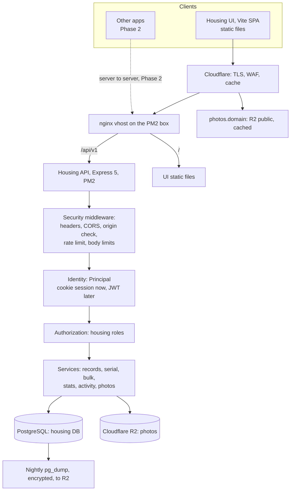

> **Superseded** by `docs/plans/2026-10-05-1147-migrate-supabase-to-org-stack-plan.md`. The database (plain SQL) and auth (own session login) choices still stand. Photos now follow `docs/plans/2026-10-04-1607-feat-photo-storage-strategy-plan.md`: S3 first, NAS later, all photos served through the API. The Security Baseline, deployment and cutover sections below are still the reference for chunks C2, C6 and C7.

## Goal Capsule

- **Objective:** Move the housing project off managed Supabase onto a small, self-hosted service that owns its data, serves its own UI, and can later be used by other apps through a versioned API.
- **Means:** One Node/TypeScript API service (Express 5), PostgreSQL on the organization box, photos in Cloudflare R2, the existing Vite React UI served as static files, deployed with PM2 and nginx.
- **Cost target:** About $0 extra per month: a process on the existing box, plus R2 within or near its free tier.
- **Not now:** Shared identity provider (asf-auth), service-to-service credentials, webhooks. The design leaves a seam for each (Phase 2).
- **Open blockers:** Confirm with the box owner that self-hosted Postgres is acceptable on the PM2 box (see Dependencies). If not, use a small managed Postgres; nothing else in this plan changes.

---

## Key Decisions

| # | Decision | Chosen over | Why |
|---|---|---|---|
| D1 | **Standalone service, API-first.** Only this service writes the housing database. Every other app goes through `/api/v1`. | Shared database between apps | One place enforces serials, bulk rules and the activity log. Safe multi-app control. |
| D2 | **Node 22 LTS + TypeScript + Express 5**, with Zod validation and `@asteasolutions/zod-to-openapi` for the spec | Hono, Fastify | The best-known framework, with the largest ecosystem and the easiest hiring and handover. Express 5 handles async errors natively. The OpenAPI spec is still generated from the Zod schemas, so other apps get a typed contract. (session-settled: user-directed.) |
| D3 | **PostgreSQL 16**, own database and roles on the org box | MySQL, SQLite, Supabase | The existing SQL relies on plpgsql functions, triggers, sequences and row locks (about 360 lines). MySQL means a rewrite; SQLite fits poorly with multi-app access. |
| D4 | **Plain SQL with `postgres` (porsager); migrations as numbered `.sql` files with dbmate** | Prisma | The existing `supabase/sql/*.sql` files become the migrations. No codegen, no engine binaries. |
| D5 | **Auth now: local email + password, opaque session in an HttpOnly cookie** | JWT in localStorage; a shared identity provider now | Smallest secure option for a few admins. Sessions can be revoked server-side. No token is readable by JavaScript. Settles contract TBD 1. |
| D6 | **Identity behind a `Principal` seam.** Housing roles live in this service. | Roles held by the login system | When asf-auth arrives, add a JWT verifier; routes and services do not change. |
| D7 | **Photos in Cloudflare R2**, public through a Cloudflare-cached custom domain; uploads re-encoded server-side | Local disk, Supabase Storage | The org is already on Cloudflare. No egress fees. Off-box, so the server stays stateless. |
| D8 | **Same repo, two deployables:** the UI at the root (unchanged) and the API in `server/` | A separate API repo | The contract, the tests and both sides change together. Split later if another team takes over the API. |

---

## Target Architecture



### Repository layout

```
/                       existing Vite React UI (unchanged location)
server/
  package.json          own deps: express@5, helmet, cors, zod, @asteasolutions/zod-to-openapi,
                        multer, postgres, @node-rs/argon2, bcryptjs, sharp,
                        aws4fetch, pino, pino-http
  src/
    app.ts              Express app: middleware order, route mounting
    config.ts           zod-validated env; the process refuses to start on bad config
    db.ts               postgres client, withActor(tx) helper
    identity/           Principal type, sessionVerifier (now), jwtVerifier (Phase 2)
    auth/               login, logout, me, password hashing, login throttle
    routes/v1/          housing, stats, bulk, activity, photos (each route: Zod schema → validate() middleware, registered in the OpenAPI registry)
    services/           business logic; all SQL lives here
    storage/            R2 client, image processing (sharp)
    middleware/         security headers, cors, originCheck, rateLimit, errors
  db/migrations/        dbmate SQL, ported from supabase/sql
  scripts/              create-admin, import-from-supabase, backup
deploy/
  ecosystem.config.cjs  PM2
  nginx/housing.conf    vhost, checked with nginx -t (nginx 1.20 syntax only)
```

---

## Security Baseline (non-negotiable)

**Authentication and sessions**
- Passwords hashed with **argon2id** (OWASP parameters: m=19 MiB, t=2, p=1). Imported Supabase bcrypt hashes are verified with bcrypt and upgraded to argon2id at the next successful login.
- Session: 32 random bytes, stored as a **SHA-256 hash** in `sessions`. Cookie `__Host-housing_session; HttpOnly; Secure; SameSite=Lax; Path=/`. Idle timeout 8 h, absolute timeout 7 days. A new session ID on every login. Logout and password change delete the sessions.
- Every login failure gives one generic message ("ইমেইল বা পাসওয়ার্ড সঠিক নয়") and costs the same time (a dummy hash check when the email is unknown).
- Login throttle: per IP and per email, for example 5 failures per 15 minutes, stored in Postgres (no Redis). Every login, failure and logout is written to the activity log.
- No signup endpoint. Admins are created, disabled and given a new password with `server/scripts/create-admin.ts`, which prompts for the password and never takes it as an argument. Disabling an admin deletes their sessions.
- A daily cleanup deletes expired sessions and login attempts older than 30 days.

**Requests**
- **CSRF:** SameSite=Lax cookie, plus a check on every non-GET request that `Origin` (or `Sec-Fetch-Site`) is in the allowlist, plus a JSON-only content type for writes. Multipart is allowed only on the photo endpoint, behind the same origin check.
- **CORS:** explicit allowlist from config, `credentials: true`, never `*`.
- **Security headers:** `helmet` on the API. The UI is static files served by nginx, so its headers (a strict CSP, HSTS, `X-Content-Type-Options`, `Referrer-Policy`, `frame-ancestors`) are set in the nginx vhost. Add another app's origin to `frame-ancestors` only if it embeds the UI.
- **Validation:** every input is checked by a Zod schema at the route. Body limit 1 MB for JSON and 10 MB for photos. Bulk requests are capped in rows.
- **SQL:** parameterized queries only (tagged templates). No string-built SQL.

**Photos**
- Size limit, magic-byte check, and a **re-encode with sharp to WebP**. Re-encoding strips EXIF and GPS data, which protects beneficiaries' locations, and it neutralizes malformed files. Keys follow the contract rule `housing/{project_type}/{serial}/{kind}[_thumb].webp`.
- The R2 credential can write only to the housing bucket. The browser never writes to storage directly.

**Database**
- Two roles: `housing_owner` (migrations only, used by CI and deploys) and `housing_app` (runtime: DML on housing tables plus EXECUTE on functions, nothing else). Postgres listens on localhost only.
- The activity-log actor comes from `SET LOCAL app.actor_id / app.actor_email / app.client` inside each write transaction. This replaces `auth.uid()` and `request.jwt.claims` in `housing_current_actor()`.

**Operations**
- Secrets live in an env file outside the repo, mode 600, owned by the service user. The service runs as its own unprivileged Linux user.
- `npm audit` and Dependabot on both packages, a lockfile, and pinned Node.
- Structured logs (pino with `redact`) with a request ID: one line per request, unexpected errors with stack traces, and security events. Passwords, cookies, tokens and request bodies are never logged. `pm2-logrotate` keeps the logs from filling the disk.
- Backups: a nightly `pg_dump`, encrypted (age), kept 30 days on R2. A restore drill before cutover and then every quarter.
- Uptime check on `/api/v1/health` (Cloudflare or a free uptime monitor).

---

## Implementation Units

### U1. Server skeleton
- **Files:** `server/package.json`, `server/src/{app,config,db}.ts`, `server/src/middleware/*`
- Express app with `app.disable('x-powered-by')` and `trust proxy` set to the nginx hop only. nginx passes the real client IP (see U9), so the per-IP login throttle does not count every request as coming from Cloudflare. Middleware order: request ID and `pino-http` → `helmet` → `cors` (allowlist) → `express.json({ limit: '1mb' })` → origin check (own ~20-line middleware; `csurf` is deprecated) → identity → routes → 404 → error handler.
- A small `validate(schema)` middleware parses `body`, `query` and `params` with Zod and returns `VALIDATION_ERROR` on failure. The same schemas are registered with `zod-to-openapi`.
- The error handler returns the contract format `{ error: { code, message, details } }` with the contract status codes.
- `GET /api/v1/health` checks the database. `GET /api/v1/openapi.json` serves the generated spec.
- **Done when:** the server starts only with valid config, and the health check passes against a local Postgres.

### U2. Database port
- **Files:** `server/db/migrations/*.sql`, ported from `supabase/sql/01,02,04,07,09`
- Keep the tables, triggers and functions. Remove RLS policies, `anon`/`authenticated` grants and `05_storage.sql`.
- Rewrite `housing_current_actor()` to read `current_setting('app.actor_*', true)`.
- Add tables: `admins (id, email citext unique, name, role, password_hash, issuer null, subject null, created_at, disabled_at)`, `sessions`, `login_attempts`.
- Create the `housing_owner` and `housing_app` roles with grants.
- **Done when:** the migrations apply from an empty database, and the serial invariants hold (never reused, never decreasing).

### U3. Identity and auth
- **Files:** `server/src/identity/*`, `server/src/auth/*`, `server/scripts/create-admin.ts`
- `Principal = { kind: 'user' | 'client', issuer, subject, email, client, roles }`. Only `sessionVerifier` exists now.
- `POST /api/v1/auth/login`, `POST /api/v1/auth/logout`, `GET /api/v1/auth/me`, plus `requireRole('admin')`.
- Follow everything in the Security Baseline under authentication.
- **Done when:** the contract auth tests pass, a non-admin is refused, the throttle triggers, and the cookie attributes are verified in tests.

### U4. Read endpoints
- List (paginated, capped), get by id, by serial, by serials, stats, years, next-serial, filter options.
- **Done when:** the read part of the backend-contract suite passes against the server.

### U5. Write endpoints
- Create, update, delete, change serial, bulk insert (all-or-nothing in one transaction), bulk update by serial, activity log read and write. Every write runs inside `withActor()`.
- **Done when:** the write part of the contract suite passes, and activity rows carry the correct actor and client.

### U6. Photos
- **Files:** `server/src/storage/*`, `server/src/routes/v1/photos.ts`
- Multipart parsing with `multer` (memory storage, `limits: { fileSize: 10 MB, files: 1 }`), mounted only on this route.
- Upload and replace, then delete. The full image and the thumbnail are generated with sharp and stored in R2 through `aws4fetch` (small, no AWS SDK). The response URL is `https://photos.<domain>/<key>?v=<photo_updated_at>`.
- **Done when:** an upload with GPS EXIF comes back stripped, a non-image is rejected, and an oversize file returns 413.

### U7. Frontend switch
- **Files:** `src/features/housing/backend/rest/*`, `.env.production`
- Finish the REST `HousingApi` adapter (today it throws NOT_IMPLEMENTED). Use cookie mode only and drop the localStorage token path. Change the paths to `/api/v1`.
- After cutover: remove `@supabase/supabase-js` and the `supabase/` adapter.
- **Done when:** `npm run test:all` passes with the backend set to `rest` against a test server, and `check:prod-bundle` confirms that no Supabase or mock code ships.

### U8. Tests against the real server
- Point `tests/contract/` and `e2e/mock` (write flows) at a disposable Postgres test database, as described in `docs/testing/README.md` ("Re-pointing the suite"). Add server unit tests for auth, the throttle, the origin check and image processing.
- CI also builds the OpenAPI spec and runs `oasdiff breaking` against the spec on `main`, so an unintended breaking API change fails the build.
- **Done when:** CI runs unit, contract and e2e tests against the server and a Postgres service container, and the breaking-change check is active.

### U9. Deployment and operations
- **Files:** `deploy/ecosystem.config.cjs`, `deploy/nginx/housing.conf`, `server/scripts/backup.sh`, CI workflow
- A tag push triggers CI (tests, then build), then a deploy to the PM2 box: migrations run as `housing_owner`, then a PM2 reload. CI reaches the box with a deploy-only SSH key held in GitHub Actions secrets.
- Staging: a second PM2 app, database and vhost on the same box (`staging-housing.<domain>`) with its own R2 bucket. It runs on seed data, except a one-time copy of production for the cutover rehearsal, which is deleted afterwards.
- nginx: `/api/v1` proxies to the service and `/` serves the static UI with the UI security headers. Restore the real client IP with `real_ip_header CF-Connecting-IP` and `set_real_ip_from` for Cloudflare's published IP ranges only, and only accept traffic from Cloudflare on this vhost. The box runs **nginx 1.20.1**, so no `http2 on;` or other newer directives, and `nginx -t` runs before every reload because the box hosts 24 vhosts.
- Cloudflare: DNS and proxy for the app and `photos.` domains, plus a WAF rate rule on `/api/v1/auth/login`.
- Set up the backups, the restore drill and uptime monitoring.
- **Done when:** a staging deploy works end to end, a restore from backup has been proven, and the full cutover (U10) has been rehearsed on staging.

### U10. Data migration and cutover
- **Files:** `server/scripts/import-from-supabase.ts`
- Copy the `housing_*` tables **including `housing_serial_counters`** (serials must never be reused), plus the activity log.
- Admins: join `housing_admins` with `auth.users` and carry over the `encrypted_password` bcrypt hashes, so nobody has to reset a password.
- Photos: copy the Supabase bucket to R2 with the same keys, then rewrite the `*_photo_url`/`*_thumb_url` base URLs with SQL.
- **Cutover:** announce a short write freeze → final export and import → verify counts and checksums → deploy the UI with `rest` → smoke test → keep Supabase read-only for 14 days as the rollback → then delete the Supabase project.
- **Done when:** the record counts, serial counters and photo counts match, and the contract suite passes against production data with read-only checks.

---

## Phase 2: Integration with Other Apps (design only, build when needed)

- **Identity:** a shared identity provider (**asf-auth**). It must issue per-audience tokens (`aud: "housing"`) and a public JWKS endpoint. Then add `jwtVerifier` to the identity chain and map `(issuer, subject)` to `admins.issuer/subject`. Retire local passwords once every admin logs in through asf-auth.
- **Machine access:** OAuth2 client credentials issued by asf-auth (preferred), or hashed API keys with scopes (`housing:read`, `housing:write`) as a stopgap. The activity log records the calling client along with the user acting.
- **UI integration:** start by serving the housing UI at a subpath behind single sign-on. Other apps build their own screens over the API when needed.
- **Events:** add webhooks only if another app must react to housing changes.

---

## Dependencies / Assumptions

- **Postgres on the PM2 box.** This may be the first self-hosted Postgres there. Confirm it with the box owner. The fallback is a small managed Postgres (about $10–15 a month).
- A Cloudflare account and zone are available for R2 and the domains.
- The number of admins is small (fewer than 20). Public reads stay unauthenticated, as today.
- The API contract (`docs/api/API_CONTRACT.md`) is the source of truth. It needs updating for `/api/v1`, cookie-only auth and the closed TBD 1 and TBD 2.

## Risks

| Risk | Mitigation |
|---|---|
| Self-hosting Postgres adds operations work | Backups and restore drills from day one. The managed fallback needs no code changes. |
| A bad nginx change breaks the other 23 vhosts | `nginx -t` in the deploy script. Use only nginx 1.20 syntax. |
| Serial counters reset during migration | Import the counters table explicitly. The contract test for "never reuse" runs after import. |
| Photo URLs broken after the move | Same keys in R2, a bulk base-URL rewrite, and a check that every URL returns 200. |
| Scope growth toward a platform | Phase 2 items are built only when integration actually starts. |

## Definition of Done

- The housing UI runs on the new service in production, and the Supabase project is deleted after the rollback window.
- Unit, contract and e2e suites pass in CI against the server.
- The Security Baseline is verified by tests (cookie flags, origin check, throttle, EXIF stripped) and by a manual review.
- Backups are running, and a restore has been proven once.
- `docs/api/API_CONTRACT.md`, `docs/architecture/migration-notes.md` and `docs/diagrams/backend-architecture.md` are updated to match.
